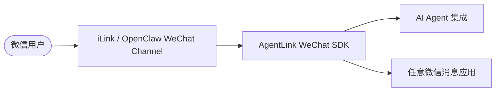

# AgentLink WeChat

OpenClaw 的快速走红，让腾讯加速推出了 `@tencent-weixin/openclaw-weixin`。这是一个积极的信号——微信正在主动向 AI Agent 生态开放，但目前仍处于早期阶段，面向 OpenClaw 宿主，尚未针对广大开发者提供直接可用的接入方式。

本仓库基于研究精神，直接对 iLink 协议进行封装，填补这个空白：不依赖 OpenClaw，让开发者现在就能把 AI Agent 或任意微信消息应用接入微信，而不必等待官方生态成熟。

微信未来大概率会推出面向更广开发者的正式接入方案，届时协议和 API 会更稳定。但对于希望尽早在这个场景里建立产品和经验的团队来说，现在开始就是优势。

## 能力与用途



## 项目定位

腾讯官方发布的 `@tencent-weixin/openclaw-weixin` 是一个 **OpenClaw 插件**，作为 OpenClaw 运行时与微信之间的通道适配器，安装时需要本地运行 OpenClaw CLI，适合已经在 OpenClaw 生态里的用户。

本仓库面向更广泛的开发者：**不依赖 OpenClaw**，直接基于微信 iLink 协议封装，可以独立集成到任意 TypeScript 项目中，构建 AI Agent 或任意微信消息应用。

## 兼容性与术语对齐

本项目会尽量与腾讯公开发布的 `@tencent-weixin/openclaw-weixin` 保持协议术语和接口语义一致，尤其参考其 npm README 中已经公开的能力描述与命名方式。

当前已对齐的方向包括：

- 接口命名：`getupdates`、`sendmessage`、`getuploadurl`、`getconfig`、`sendtyping`
- 长轮询与同步游标语义：`get_updates_buf`
- 消息状态术语：`NEW`、`GENERATING`、`FINISH`
- 媒体上传与 CDN / AES 相关术语
- typing ticket、Channel、多账号等表述

当前文档与实现参考的公开信息基线为：

- `@tencent-weixin/openclaw-weixin@2.1.1`
- 核对日期：2026-03-28

以下内容是有意保持不同的：

- 仓库结构
- 包名与发布目标
- 本地运行时目录布局
- SDK 抽象层与示例组织方式

也就是说：协议层术语尽量对齐官方插件，工程形态与开发者体验则保持本仓库自己的独立设计。

## 特性

- 扫码登录与本地会话持久化
- 基于长轮询的文本消息收发
- 流式回复与 typing 指示器
- 图片、文件、视频上传下载与 AES 媒体处理
- 多账号出站解析、白名单配对、斜杠命令
- Node.js 18+，运行时仅依赖内置模块

## 在你的项目中使用

本仓库尚未发布到 npm，有两种方式引入：

**方式一：GitHub 依赖（推荐）**

在你的项目 `package.json` 中添加：

```json
{
  "dependencies": {
    "@agentlink/wechat": "github:niugeex/agentlink-wechat"
  }
}
```

然后执行：

```bash
npm install
```

npm 会自动克隆仓库并触发构建，安装完成后可直接使用。`docs/`、`src/`、`test/`、`examples/` 等开发文件不会进入你的 `node_modules`。

**方式二：本地路径依赖**

先克隆并构建本仓库：

```bash
git clone https://github.com/niugeex/agentlink-wechat.git
cd agentlink-wechat
npm install && npm run build
```

再在你的项目 `package.json` 中指向本地路径：

```json
{
  "dependencies": {
    "@agentlink/wechat": "file:../agentlink-wechat"
  }
}
```

两种方式安装完成后，按包名导入即可：

```ts
import { AgentLinkWechat } from '@agentlink/wechat';
```

## 快速开始

前置要求：

- Node.js 18+
- npm

安装依赖：

```bash
npm install
```

构建 SDK：

```bash
npm run build
```

运行测试：

```bash
npm test
```

运行基础回声示例：

```bash
npm run demo:echo-bot
```

这个示例会验证最基础的链路：扫码登录、接收消息、发送回复。登录完成后，给 bot 发送一条消息，它会自动回复 `echo: <message>`。

运行多账号回声示例：

```bash
npm run demo:multi-account
```

这个示例会自动加载本地已保存账号；如果本地还没有账号，则会直接进入扫码登录流程。它适合验证多账号启动、账号列表查看、新增账号登录，以及同一个示例同时挂多个微信 bot 的基本能力。

## 最小示例

```ts
import { AgentLinkWechat, NetworkError } from '@agentlink/wechat';

const bot = new AgentLinkWechat();

bot.on('qrcode', (url) => console.log('请扫码登录:', url));
bot.on('login', (credentials) => console.log('登录成功:', credentials.botId));

bot.on('message', async (message) => {
  console.log(`${message.userId}: ${message.text}`);
  await message.reply(`echo: ${message.text}`);
});

bot.on('error', (error) => {
  if (error instanceof NetworkError && error.isTimeout) return;
  console.error('bot error', error);
});

await bot.login();
await bot.waitForLogin();
await bot.start();
```

常用 API：

| 方法 / 事件 | 说明 |
|---|---|
| `login()` / `waitForLogin()` | 发起扫码登录，等待会话建立 |
| `start()` / `stop()` | 启动或停止长轮询 |
| `listAccounts()` | 查看本地已保存账号 |
| `sendText()` / `sendImage()` / `sendFile()` | 主动发送消息（需已缓存上下文） |
| 事件 `message` | 收到新消息，携带 `text`、`userId`、`timestamp` 和 `reply()` |
| 事件 `qrcode` / `qrcode:scanned` | 二维码就绪 / 已扫码待确认 |
| 事件 `login` / `logout` / `error` | 登录状态变化与错误 |

## 示例场景

### echo-bot — 基础链路验证

[examples/echo-bot.ts](examples/echo-bot.ts)

扫码登录、接收消息、原文回复。最小可运行示例，适合验证账号是否能正常收发消息。

```bash
npm run demo:echo-bot
```

启动后扫码登录，给 bot 发任意消息，会收到 `echo: <你的消息>` 回复。

---

### weather-bot — 接入外部接口

[examples/weather-bot.ts](examples/weather-bot.ts)

把 open-meteo 公共天气 API 接入微信消息交互，演示如何在消息处理器里调用外部服务。启动时若检测到本地已保存账号则跳过扫码，会自动打开二维码浏览器窗口（Windows / macOS / Linux）。

```bash
npm run demo:weather
```

在微信里发送：

| 消息 | 说明 |
|---|---|
| `/weather 上海` | 查询上海实时天气 |
| `/weather Beijing` | 支持英文城市名 |
| `/help` | 查看命令说明 |

回复包含实时天气、体感温度、湿度、风速、今日温度区间和降水概率。

---

### send-media — 图片与文件收发

[examples/send-media.ts](examples/send-media.ts)

演示图片、文件、视频的上传发送与 AES 媒体处理流程。启动时若检测到本地已保存账号则跳过扫码。

```bash
npm run demo:send-media
```

在微信里发送（路径为相对于项目根目录的相对路径）：

| 消息 | 说明 |
|---|---|
| `/send-image examples/assets/demo-card.png` | 发送图片 |
| `/send-file examples/assets/demo-brief.txt` | 发送文件 |
| `/send-video examples/assets/demo-video.mp4` | 发送视频 |
| `/help` | 查看命令说明 |

---

### multi-account-echo — 多账号并行

[examples/multi-account-echo.ts](examples/multi-account-echo.ts)

启动时自动加载本地已保存账号，没有则进入扫码登录流程。多个账号同时在线，每个账号独立收发消息，回复格式为 `[<botId>] echo: <消息>`。

```bash
npm run demo:multi-account
```

**终端命令**

| 命令 | 说明 |
|---|---|
| `accounts` | 查看当前在线账号列表 |
| `login-new` | 为新账号发起扫码登录 |
| `help` | 查看帮助 |
| `quit` | 停止所有 bot 并退出 |

**微信内命令**

| 命令 | 说明 |
|---|---|
| `/accounts` | 查看在线账号列表 |
| `/login-new` | 触发新账号扫码登录（会弹出二维码窗口） |
| `/logout` | 登出当前 bot 账号 |

---

### openai-doc-agent — AI Agent 接入

[examples/openai-doc-agent.ts](examples/openai-doc-agent.ts)

基于 OpenAI Agents SDK 的文档问答 bot。启动逻辑与 weather-bot 相同：检测到本地已保存账号则直接启动，否则扫码登录。收到消息后，Agent 先用 `search_docs` 在本地文档里检索相关片段，不够用时再用 `read_doc` 读取完整文档，最后用简体中文回复。模型返回的 Markdown 会自动转换为适合微信阅读的纯文本。文档之外的问题，Agent 会明确告知无法回答，而不是猜测。

**配置**

首次运行时若 `examples/openai-doc-agent.config.json` 不存在，会交互式引导填写并写入本地文件：

```json
{
  "apiKey": "<your-api-key>",
  "baseURL": "https://openrouter.ai/api/v1",
  "model": "xiaomi/mimo-v2-pro",
  "api": "chat_completions"
}
```

`api` 字段支持 `chat_completions`（默认）和 `responses` 两种模式，对应 OpenAI Agents SDK 的两套调用路径。配置文件已加入 `.gitignore`，不会提交。模板见 [examples/openai-doc-agent.config.example.json](examples/openai-doc-agent.config.example.json)。

**运行**

```bash
npm run demo:openai-agent
```

Agent 检索的文档范围固定为 `README.md`、`docs/wechat-ilink-protocol.md`、`docs/wechat-sdk-design.md`。

## 白名单与配对

默认私聊策略为 `pairing`。扫码登录成功的账号会自动加入允许列表，你也可以手动传入：

```ts
const bot = new AgentLinkWechat({
  allowFrom: ['<allowed-user-id>@im.wechat'],
});
```

如果希望关闭白名单校验，可以设置 `dmPolicy: 'open'`。

## 仓库结构

- `docs/`：协议调研与 SDK 设计文档
- `src/`：TypeScript SDK 源码
- `test/`：单元测试
- `examples/`：可直接运行的示例程序

## 文档索引

- [协议调研文档](./docs/wechat-ilink-protocol.md)
- [SDK 设计文档](./docs/wechat-sdk-design.md)

## 开源说明

- License：MIT
- Node.js 支持版本：`>=18`
- 构建产物目录：`dist/`
- 本地 demo 配置文件不会提交：`examples/openai-doc-agent.config.json`
- 默认运行时数据目录位于用户主目录下的 `.agentlink/wechat`

如果后续要进一步公开发布或长期维护，建议持续关注官方 OpenClaw 微信插件公开文档中的协议变化、兼容性范围和术语更新。
